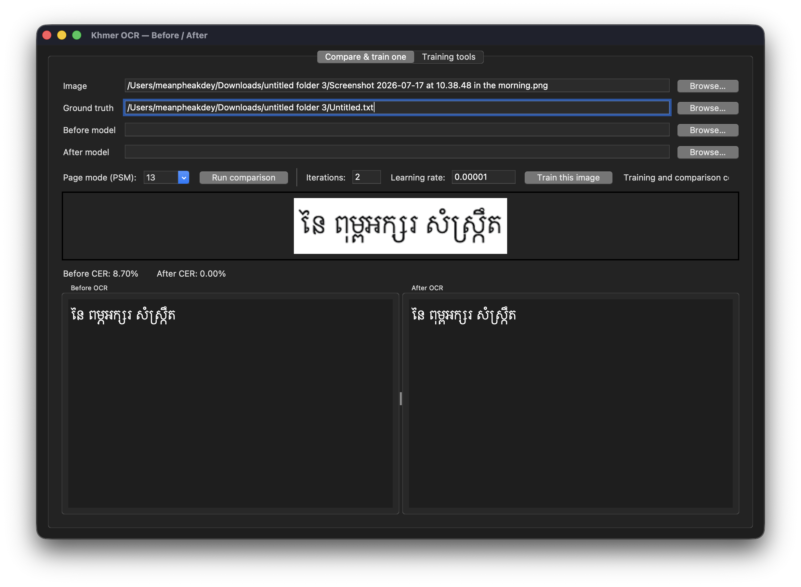

# Khmer Tesseract Training

[](LICENSE)
[](https://github.com/tesseract-ocr/tesseract)
[](https://www.python.org/)

A reproducible toolkit and desktop application for fine-tuning Khmer Tesseract
OCR, evaluating changes, and exporting a deployable custom model.

The project supports quick corrections from one annotated image, larger
dataset training, non-repeating batches, archive imports, before/after OCR
comparison, and guarded model replacement. The final artifact is:

```text
output/khm_custom.traineddata
```

## Demo



_Incremental-training demo: CER on the selected annotated sample improved from
8.70% to 0.00%. This training-sample result demonstrates the workflow; it does
not replace evaluation on a separate, representative test set._

> [!IMPORTANT]
> Successful training only proves that Tesseract produced a model. It does not
> prove the model is more accurate. Always evaluate representative images that
> were not used for training before deploying a new model.

## Contents

- [Highlights](#highlights)
- [Quick start](#quick-start)
- [Requirements](#requirements)
- [Ground-truth format](#ground-truth-format)
- [Desktop application](#desktop-application)
- [Command-line workflows](#command-line-workflows)
- [Training modes](#training-modes)
- [Evaluation and export](#evaluation-and-export)
- [Safety mechanisms](#safety-mechanisms)
- [Configuration](#configuration)
- [Project structure](#project-structure)
- [Troubleshooting](#troubleshooting)
- [Contributing and security](#contributing-and-security)
- [License](#license)

## Highlights

- Fine-tunes from the official `tessdata_best/khm.traineddata` model.
- Uses the official [`tesseract-ocr/tesstrain`](https://github.com/tesseract-ocr/tesstrain)
  training tools.
- Provides a desktop interface for comparison, incremental training, setup,
  validation, full training, batch management, export, and live command logs.
- Keeps every graphical workflow available as a Make command for automation.
- Accepts single-line images and multi-line pages with one ground-truth line
  per visible image line.
- Supports full-dataset, fast-subset, and non-repeating batch training.
- Imports line annotations from the supported archive XML layout.
- Calculates character error rate (CER) when verified text is available.
- Backs up the current model before incremental replacement.
- Blocks duplicate and concurrent incremental training.
- Keeps local scans, generated datasets, checkpoints, and models out of Git.

## Quick start

```sh
git clone https://github.com/itskdey/tesseract_khmer_training.git
cd tesseract_khmer_training

brew install tesseract wget unzip git make python python-tk@3.13
python3 -m pip install Pillow

make check
make setup
make compare-app
```

The app contains two tabs:

1. **Compare & train one** — select an image and verified text, compare models,
   or perform a conservative incremental update.
2. **Training tools** — run setup, preparation, validation, full/fast/batch
   training, batch management, export, comparison, and cleanup with live logs.

## Requirements

The current workflow is developed and tested on macOS with Homebrew.

| Dependency | Purpose |
|---|---|
| Tesseract | OCR, LSTM sample generation, evaluation, and model tooling |
| GNU Make (`gmake`) | Runs official tesstrain targets |
| Python 3.9+ | Dataset preparation, application, and training helpers |
| Pillow | Image loading, preview, cropping, and line segmentation |
| Tk | Desktop application |
| Git, `wget`, `unzip` | Setup and dependency retrieval |

Install the command-line dependencies:

```sh
brew install tesseract wget unzip git make python
python3 -m pip install Pillow
```

Install the compatible Homebrew Tk runtime for the desktop application:

```sh
brew install python-tk@3.13
```

Verify the environment:

```sh
make check
```

Download the official tesstrain repository and base models:

```sh
make setup
```

Setup creates or updates:

```text
tesstrain/
tessdata_best/khm.traineddata
tessdata_best/eng.traineddata
```

## Ground-truth format

Ground truth is the exact, manually verified text visible in an image. It is
the expected answer used for training and accuracy measurement.

### Single-line image

Use matching filenames:

```text
sample.png
sample.gt.txt
```

`sample.gt.txt` must contain exactly the text visible in `sample.png`.

### Multi-line page

Put every visible image line on the corresponding line in the text file:

```text
first visible line
second visible line
third visible line
```

The incremental trainer converts a page into Tesseract-compatible line-level
pairs. It tries Tesseract layout analysis, pixel projection, and guided
whitespace splitting. Training stops before model replacement if the page
cannot be paired safely.

Ground-truth rules:

- Transcribe the image exactly, including Khmer marks, punctuation, digits,
  Latin text, and spaces.
- Do not use uncorrected OCR output as final ground truth.
- Do not add text that is not visible in the image.
- Keep one text line per visible image line for page-level input.
- Review every transcription manually.

## Desktop application

Launch the app:

```sh
make compare-app
```

### Compare models

1. Select an image.
2. Optionally select its `.gt.txt`; a matching file beside the image is loaded
   automatically.
3. Select the Before and After `.traineddata` files.
4. Choose a page segmentation mode (PSM).
5. Click **Run comparison**.

The app displays both OCR results and, when ground truth is provided, the CER
for each model. Lower CER is better; `0%` is an exact character match.

### Train one annotated image

1. Select a PNG image.
2. Select its verified `.gt.txt` file.
3. Keep the conservative defaults unless you understand the overfitting risk:
   two iterations and a learning rate of `0.00001`.
4. Click **Train this image** and confirm.

After successful training, the app:

1. builds line-level samples;
2. fine-tunes from the current custom model, or the base Khmer model on the
   first run;
3. verifies the candidate model;
4. backs up the current model;
5. installs the candidate as `output/khm_custom.traineddata`; and
6. compares the backup with the updated model.

The selected training example is not an independent test. Improvement on that
same image may be overfitting, so also test unrelated images.

## Command-line workflows

All app operations remain available from the terminal.

| Command | Description |
|---|---|
| `make check` | Verify required command-line tools |
| `make setup` | Clone/update tesstrain and download base models |
| `make prepare` | Split images from `raw_pages/` into line-level pairs |
| `make import-archive` | Import the supported annotated XML archive |
| `make validate` | Check image/text pairing and non-empty ground truth |
| `make compare-app` | Launch the desktop application |
| `make train-one` | Incrementally train one image/text pair |
| `make train` | Train with all configured ground truth |
| `make fast-subset` | Create a smaller randomized training subset |
| `make train-fast` | Create and train a fast subset |
| `make batch` | Create the next non-repeating batch |
| `make train-batch` | Create, train, and finalize the next batch |
| `make batch-status` | Show used and remaining batch lines |
| `make batch-finalize` | Mark a successful pending batch as used |
| `make batch-reset` | Reset used-line history |
| `make export` | Export the configured custom model |
| `make compare` | Compare models on files in `test_images/` |
| `make clean` | Remove generated checkpoints and temporary training output |

CLI-only before/after comparison:

```sh
python3 compare_app.py --cli test_images/example.png
```

Specify ground truth and page segmentation mode when needed:

```sh
python3 compare_app.py --cli test_images/example.png \
  --truth test_images/example.gt.txt \
  --psm 6
```

## Training modes

### Incremental correction

Place one PNG and its matching text file in `train_one/`:

```text
train_one/sample.png
train_one/sample.gt.txt
```

Run:

```sh
make train-one
```

The default update is deliberately small:

```sh
make train-one ONE_MAX_ITERATIONS=2 ONE_LEARNING_RATE=0.00001
```

The exact same image/text content cannot be trained twice. A deliberate
terminal override is available, but repeated correction can harm general OCR:

```sh
make train-one ONE_FORCE_RETRAIN=1
```

### Full training

Train every valid pair in `ground_truth/`:

```sh
make train TESSTRAIN_JOBS=8
```

Default full-training settings:

```text
MODEL_NAME=khm_custom
START_MODEL=khm
TESSDATA=./tessdata_best
GROUND_TRUTH_DIR=./ground_truth
OUTPUT_DIR=./output
MAX_ITERATIONS=10000
RATIO_TRAIN=0.90
TESSTRAIN_JOBS=4
```

Full training can take many hours and can still reduce accuracy when labels,
segmentation, or dataset balance are poor.

### Fast subset

```sh
make train-fast
make train-fast FAST_LIMIT=10000
```

The subset is deterministic for the configured seed and is intended for fast
experiments, not as proof of production quality.

### Non-repeating batches

```sh
make train-batch
make train-batch BATCH_SIZE=5000
make batch-status
```

The default batch contains 2,000 unused source lines. Source stems are marked
as used only after the training command succeeds. The manifest is stored at:

```text
output/batches/used_stems.txt
```

Reset batch history only when you intentionally want to reuse lines:

```sh
make batch-reset
```

### Prepare scans

Place scans in `raw_pages/`, then run:

```sh
make prepare
```

Supported formats are PNG, JPEG, TIFF, and BMP. The script creates cropped line
images and empty `.gt.txt` files in `ground_truth/`. Fill every text file and
validate it before training:

```sh
make validate
```

### Import annotated XML

The importer expects this layout beside the repository:

```text
../archive/
  PNG_Files/PNG_Files/
  XML_Files/XML_Files/
```

Run:

```sh
make import-archive
```

The importer crops annotated XML lines and writes image/text pairs to
`ground_truth/`. Importing with the Make target clears existing generated PNG
and `.gt.txt` output, so back up important local data first.

## Evaluation and export

### Evaluate test images

Place representative images that were not used for training in `test_images/`:

```sh
make compare
```

For each image, results are written to `output/comparison/`:

```text
example.khm.txt
example.khm_custom.txt
example.side_by_side.txt
```

For reliable evaluation:

- keep the test set separate from training data;
- include different fonts, resolutions, scan quality, layouts, and topics;
- report aggregate CER across the complete test set;
- compare against the unchanged official Khmer base model; and
- reject candidates that improve one sample but regress overall.

### Export

```sh
make export
```

The exported model is:

```text
output/khm_custom.traineddata
```

To use it in another application, copy the file into that application's
Tesseract tessdata or asset location and load it with the language name
`khm_custom`.

## Safety mechanisms

Incremental training includes several safeguards:

- **Candidate-first replacement** — the current model is replaced only after
  training finishes and the candidate can be unpacked by Tesseract.
- **Automatic backups** — prior models are stored in `output/backups/`.
- **Duplicate protection** — successful image/text content fingerprints are
  stored in `output/train_one_history.tsv`; identical content is rejected.
- **Concurrency lock** — `output/.train-one.lock` prevents simultaneous app or
  terminal jobs from writing the same model.
- **Conservative defaults** — two iterations and a low learning rate reduce,
  but do not eliminate, catastrophic forgetting.
- **Segmentation failure isolation** — page-splitting errors stop before model
  replacement.

Backups and safeguards make failures recoverable; they do not guarantee an
accuracy improvement.

## Configuration

Make variables can be supplied on the command line:

| Variable | Default | Purpose |
|---|---:|---|
| `MODEL_NAME` | `khm_custom` | Output language/model name |
| `START_MODEL` | `khm` | Base model used by full training |
| `TESSDATA` | `./tessdata_best` | Base-model directory |
| `GROUND_TRUTH_DIR` | `./ground_truth` | Full-training dataset |
| `OUTPUT_DIR` | `./output` | Generated artifacts and models |
| `MAX_ITERATIONS` | `10000` | Full-training iteration limit |
| `RATIO_TRAIN` | `0.90` | Full-training split ratio |
| `TESSTRAIN_JOBS` | `4` | Parallel tesstrain jobs |
| `FAST_LIMIT` | `5000` | Fast-subset pair count |
| `BATCH_SIZE` | `2000` | Non-repeating batch size |
| `ONE_MAX_ITERATIONS` | `2` | Incremental iteration limit |
| `ONE_LEARNING_RATE` | `0.00001` | Incremental learning rate |
| `ONE_FORCE_RETRAIN` | `0` | Explicit duplicate-training override |
| `COMPARE_APP_PYTHON` | Homebrew 3.13 if installed | GUI Python runtime |

Example:

```sh
make train MAX_ITERATIONS=5000 RATIO_TRAIN=0.95 TESSTRAIN_JOBS=8
```

## Project structure

```text
tesseract_khmer_training/
├── compare_app.py          # Desktop app and CLI comparison tool
├── Makefile                # Public command interface
├── scripts/                # Setup, preparation, training, and export helpers
├── raw_pages/              # Local source scans
├── line_images/            # Generated line crops
├── ground_truth/           # Main line-level training pairs
├── ground_truth_fast/      # Generated fast subset
├── ground_truth_batch/     # Current non-repeating batch
├── train_one/              # One incremental image/text pair
├── test_images/            # Local evaluation images
├── tessdata_best/          # Downloaded official base models
├── tesstrain/              # Official tesstrain checkout
└── output/                 # Models, backups, checkpoints, logs, and comparisons
```

Large datasets and generated artifacts are intentionally ignored by Git.

## Troubleshooting

### Ground truth contains multiple lines

This is supported for page images. Ensure each non-empty `.gt.txt` line maps to
one visible image line in the same top-to-bottom order. If segmentation still
fails, use a cleaner page image or crop it into individual line images.

### The same pair has already been trained

Duplicate protection is working. Select another sample or correct the image or
text. Use `ONE_FORCE_RETRAIN=1` only when repeated training is intentional.

### Another incremental training job is running

Wait for the existing app or terminal job to finish. If a machine crash left a
stale lock, the next run removes it automatically when its recorded process is
no longer alive.

### The trained model is worse

Restore a model from `output/backups/` and review:

- transcription accuracy;
- line-image and text alignment;
- training/test leakage;
- font and layout diversity;
- iteration count and learning rate; and
- aggregate held-out CER compared with the official base model.

More training data or more iterations do not automatically produce a better
model.

### The desktop app does not open on macOS

Install the Homebrew Tk runtime and relaunch:

```sh
brew install python-tk@3.13
make compare-app
```

Override the runtime when necessary:

```sh
make compare-app COMPARE_APP_PYTHON=/path/to/python3
```

### Missing base model or tesstrain checkout

```sh
make setup
```

## Data and model policy

The following remain local by default:

- raw scans and test images;
- generated ground-truth pairs;
- downloaded base models and tesstrain checkout;
- checkpoints, logs, comparisons, backups, and exported models.

Confirm that you have permission to use every dataset. Do not publish private,
sensitive, or copyrighted source material without authorization.

## Contributing and security

Contributions are welcome. Read [CONTRIBUTING.md](CONTRIBUTING.md) before
opening an issue or pull request.

Report security concerns using the process in [SECURITY.md](SECURITY.md), not a
public issue.

This project builds on Tesseract OCR and the official tesstrain project. It is
not an official Tesseract project.

## License

Licensed under the MIT License. See [LICENSE](LICENSE).
